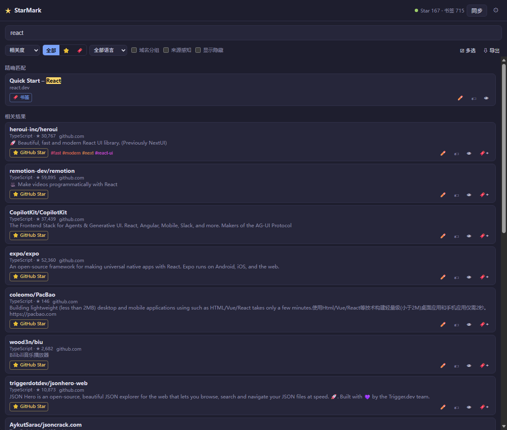
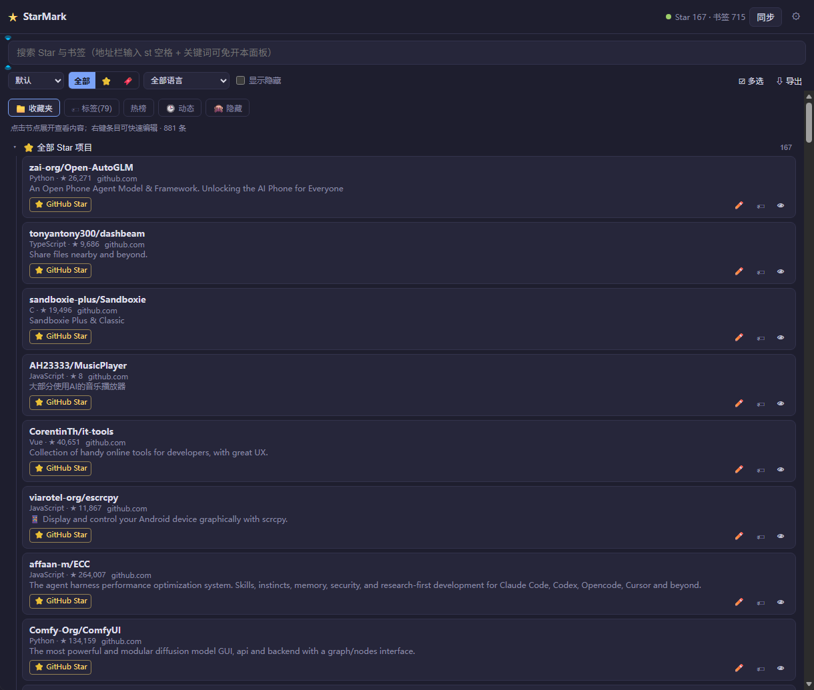
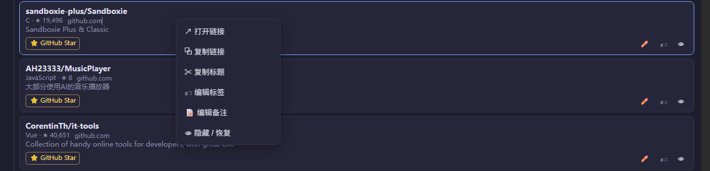
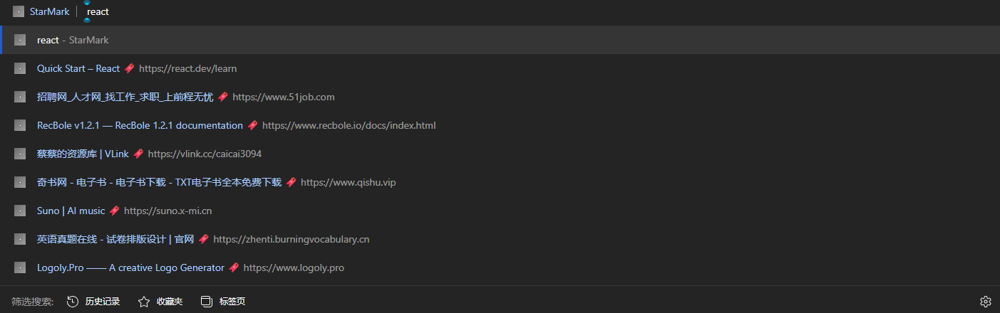
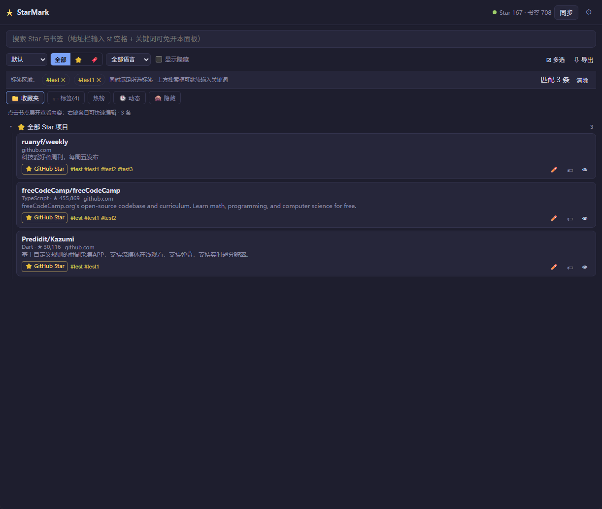
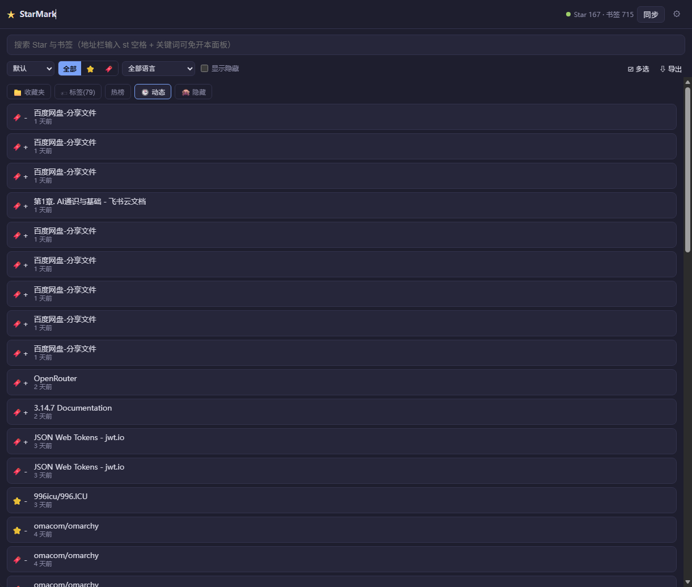
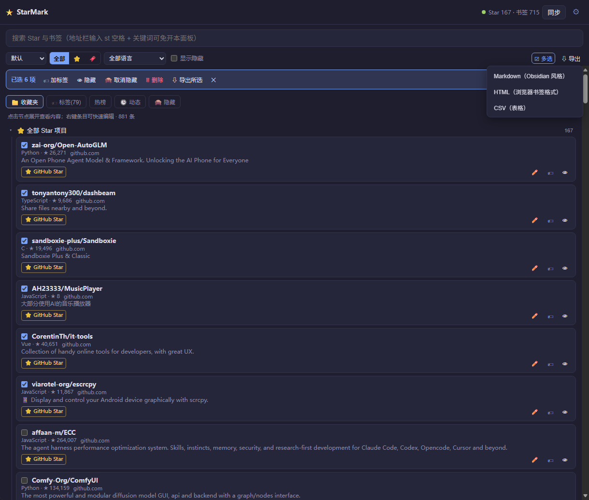
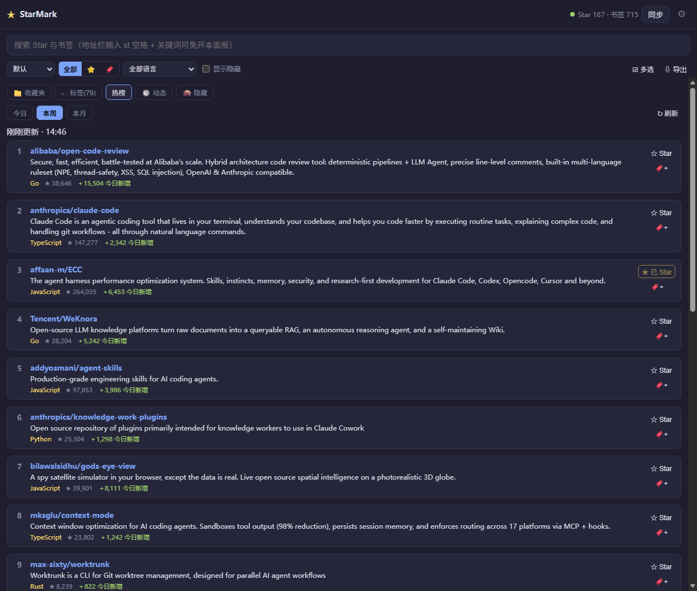
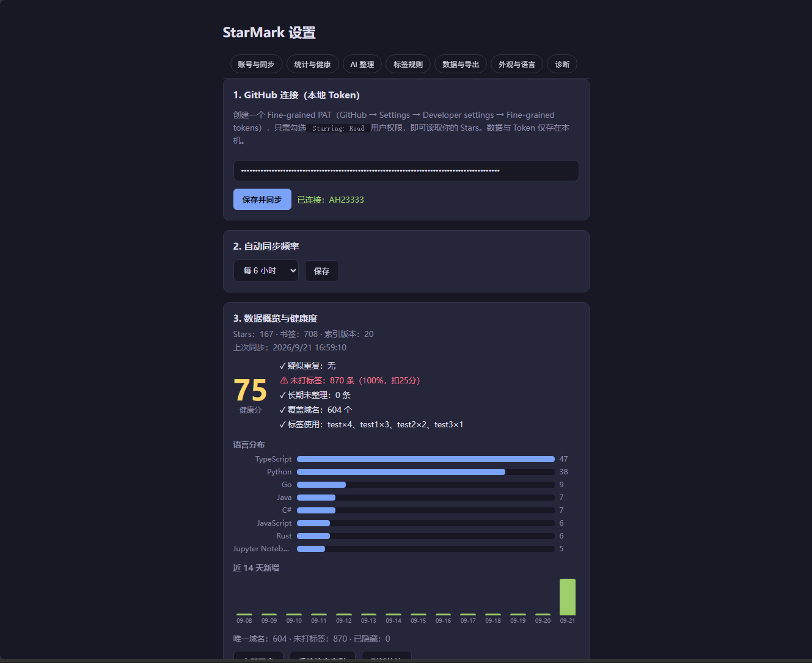

# StarMark

> 统一搜索 GitHub Stars 与浏览器书签的本地入口 —— 像查书签一样快，一句话找到 Star 过的项目。

[](package.json)
[](https://developer.chrome.com/docs/extensions/)
[](package.json)
[](LICENSE)

---

## 📖 简介

StarMark 是一款面向 Chrome/Edge（Manifest V3）的浏览器扩展。它将你的 **GitHub Stars** 和 **浏览器书签** 整合到同一个本地搜索入口：侧边栏 / 地址栏输入关键词即可同时检索两类内容，结果按来源分组展示，数据 100% 存在本地。

针对两个真实痛点设计：

- **Stars 只进不出**——Star 了就忘，找项目靠翻页；
- **书签与 Stars 是两个孤岛**——浏览器找书签、GitHub 找 Star，互不相通。

在这个基础上，它还长出了第三层能力：**用 AI 把这两座孤岛整理成一套可检索、可聚合的标签体系**——同样只做一件小事：让"找"这件事快到不需要想。

## ✨ 功能特性

### 搜索与浏览

- **统一搜索**：侧边栏搜索框 + 地址栏 `st` 关键字，书签与 Stars 混排分组展示
- **本地索引**：MiniSearch 全文索引（前缀 + 模糊匹配 + 字段加权），构建/查询在 Web Worker 中进行，不阻塞 UI
- **优质中文支持**：按整串 + 单字 + 相邻二元组分词，中文标题子串可命中
- **收藏夹树**：未搜索时展示书签文件夹树 + 「⭐ 全部 Star 项目」特殊目录，移动/改名即时回溯真实路径
- **去重合并**：同一条内容的 http/https、www 变体自动归一合并（GitHub 域强制 https），同时显示 Star / 书签双来源标记

### 整理与管理

- **AI 整理标签**：接入你自己的 LLM（本地 Ollama 或云端 OpenAI 兼容 / Anthropic），50 条/批自动分组全部条目、按组预览与应用；支持**暂停 / 继续 / 断点续跑**，优先复用现有标签避免碎片化
- **规则自动标签**：按域名 / URL / 标题 / 语言配置标签规则，新条目即时命中
- **批量操作**：多选加标签 / 隐藏 / 删除（含浏览器书签联动删除）
- **导出**：全库或所选条目导出 Markdown / HTML（Netscape 格式）/ CSV
- **动态时间线**：Star / 书签的新增移除按时间倒序，追溯你的兴趣轨迹

### 体验与隐私

- **热榜推荐**：抓取 github.com/trending（日 / 周 / 月），一键 Star 或存书签，本地按日缓存
- **多语言界面**：简体中文 / 日本語 / English，设置页随时切换（默认跟随浏览器）
- **三种外观主题**：跟随系统 / 浅色 / 深色
- **自动同步**：GitHub Stars 定时同步（默认 6h，ETag 增量），书签变更事件增量同步，全部可恢复、幂等
- **隐私安全**：PAT 仅存 `chrome.storage.local`，无任何服务器中转，可一键清除数据

## 📸 界面速览

> 截图文件放置于 `docs/screenshots/`（对照 [`docs/screenshots/README.md`](docs/screenshots/README.md) 的拍摄清单逐一截图后按文件名放入即可）。

| | |
|:---:|:---:|
|  |  |
| **01 · 侧边栏搜索**：关键词混排命中，来源过滤与排序 | **02 · 收藏夹树浏览**：文件夹树 + 全部 Star 目录 |
|  |  |
| **03 · 结果卡片**：标签 / 笔记 / 置顶 / 右键菜单 | **04 · 地址栏建议**：`st` 关键字直接呼出 |
|  |  |
| **05 · 标签云**：频次统计，点击即筛 | **06 · 动态时间线**：Star / 书签增删轨迹 |
|  |  |
| **07 · 批量多选 + 导出**：加标签 / 隐藏 / 删除 | **08 · 热榜推荐**：日 / 周 / 月，一键 Star |
|  |  |
| **09 · 深色主题**：全界面深浅色随主题 | **10 · 设置页**：Token / 统计 / 健康度 |

### AI 整理标签

| | |
|:---:|:---:|
|  |  |
| **11 · AI 整理面板**：Provider 配置、运行进度、暂停/继续 | **12 · 分组预览与应用**：按标签组预览，单组或全部应用 |
|  |  |
| **13 · 规则自动标签**：域名 / URL / 标题 / 语言规则 | **14 · 规则命中**：新条目即时打标 |

## 🚀 快速开始

### 安装（开发者模式）

需要 Chrome/Edge ≥ 116。

```bash
npm install
npm run dev        # 开发模式（HMR + 快速重载），或
npm run build      # 生产构建，产物在 .output/chrome-mv3
```

1. 打开 `chrome://extensions`
2. 开启右上角「开发者模式」
3. 「加载已解压的扩展程序」→ 选择 `.output/chrome-mv3` 目录

### 启用 Stars

1. GitHub → Settings → Developer settings → Fine-grained personal access tokens
2. 生成 token，权限勾选 **Starring: Read**（如需"书签 → Star"一键互转，勾选 **Starring: Write**）
3. 粘贴到 StarMark 设置页 → 「保存并同步」

### 接入 AI（可选）

**本地 Ollama（数据不出本机）**：

1. 安装并启动 Ollama（`ollama serve`），`ollama pull <模型>` 拉取模型
2. 设置页 Provider 选 **Ollama（本地模型）**，端点默认 `http://127.0.0.1:11434`，点「测试连接」列出本地模型
3. 若提示 403（Ollama ≥0.1.47 的来源白名单），重启 Ollama 前设置环境变量 `OLLAMA_ORIGINS="*"`——扩展已默认尝试自动放行，通常无需此步

**云端 Provider**：选 OpenAI 兼容 / Anthropic，填入你自己的 API Key 与端点（条目标题/描述会发往你自配的服务商）。

## 📖 使用指南

| 场景 | 操作 |
|------|------|
| 搜某个项目 | 点击工具栏图标打开侧边栏直接输入；或在地址栏输入 `st <关键词>` |
| 启用 Stars | 设置页粘贴 GitHub PAT 并「保存」→ 或直接点「同步」 |
| 查看全部 Star | 侧边栏未输入时展开「⭐ 全部 Star 项目」 |
| AI 整理标签 | 设置页「AI 整理标签」→ 选 Provider →「开始 AI 整理」→ 实时进度可暂停/继续 → 完成后按组预览并应用 |
| 规则自动标签 | 设置页「规则自动标签」面板配置规则，新条目即时命中 |
| 批量操作 / 导出 | 侧边栏「☑ 多选」→ 加标签 / 隐藏 / 删除；「⇩ 导出」全库或所选 |
| 热榜推荐 | 侧边栏「热榜」页签，日 / 周 / 月切换，一键 Star 或存书签 |
| 定时同步 | 设置页调整同步频率（默认 6 小时） |
| 深色 / 浅色 | 设置页「外观主题」选择跟随系统 / 浅色 / 深色 |
| 界面语言 | 设置页语言下拉切换（默认跟随浏览器语言） |

## 🔐 隐私与数据安全

> Token 仅保存在本机 `chrome.storage.local`，不通过任何服务器中转；请勿将其提交到公开仓库。

- 全部书签 / Star / 标签 / 笔记数据保存在本机 IndexedDB，**不会上传到任何服务器**；
- 联网请求仅三类：`api.github.com`（同步你的 Star 列表）、`github.com/trending`（热榜页）、favicon 图标服务；
- **AI 数据流向**：本地 Ollama 模式数据不出本机；云端 Provider 模式下条目标题 / 描述会发往你自配的服务商（BYOK，无中间服务器）；
- 支持加密备份导出（可设口令）与一键清除全部本地数据。

## ⚙️ 工作原理

```
浏览器书签 ──▶ chrome.bookmarks API ──┐
                                      ├──▶ Dexie (IndexedDB) ──▶ MiniSearch Worker ──▶ 侧边栏/地址栏搜索
GitHub Stars ──▶ GitHub REST API (PAT)─┘    (本地唯一数据源)
                                      └──▶ Ollama / 云端 LLM（仅 AI 整理时，BYOK）
```

- **Stars**：`GET /user/starred` 分页拉取（含 `starred_at`），条件请求（ETag 仅认第一页指纹），未变化 304 零成本跳过；断点续跑状态机应对 MV3 Service Worker 随时终止。
- **书签**：安装/启动时一次 `getTree` 直读完整树批量入库；之后订阅 `onCreated/onRemoved/onChanged/onMoved` 增量更新（1s 节流批量写入），即时回溯真实目录路径。
- **长任务架构**：AI 整理 / 同步 / 书签遍历等长任务一律「同步落盘运行状态 → 立即返回 → 后台循环 + 检查点」，UI 轮询进度；AI 请求带心跳保活与 AbortSignal（暂停即切断模型推理）。
- **数据完整性**：条目主键 128-bit 哈希（碰撞概率可忽略）；URL 变体归一合并；同步合并保留用户字段（标签 / 笔记 / 回顾进度）；Schema v1–v6 自动迁移。

## 🧱 技术栈

WXT · TypeScript · React · Dexie (IndexedDB) · MiniSearch · CommunityToolkit 风格消息模式 · Vitest

## 📁 项目结构

```
StarMark/
├─ src/
│  ├─ entrypoints/
│  │  ├─ background.ts       # Service Worker：同步作业、书签事件、omnibox、alarms、消息路由表
│  │  ├─ sidepanel/          # 侧边栏页面（React，components/ 拆分）+ search-worker.ts（MiniSearch Worker）
│  │  └─ options/            # 设置页（panels/ 拆分：PAT、AI 整理、规则、导出、诊断、数据管理）
│  ├─ core/
│  │  ├─ ai/                 # LLM Provider（Ollama/OpenAI/Anthropic）、建议流水线、批量分类
│  │  ├─ locales/            # 三语词典（zh-CN / ja / en）
│  │  ├─ api/                # GitHub REST 客户端
│  │  ├─ sync/               # Stars 同步状态机 + 书签同步
│  │  ├─ search/             # 查询编排纯函数、过滤谓词、索引配置、Worker 协议
│  │  ├─ constants.ts        # 全局常量（分块/轮询/心跳/阈值）
│  │  ├─ errors.ts           # 错误分类体系（AppError 子类）
│  │  ├─ db.ts               # Dexie 定义（v1–v6 迁移）、条目/计数/批量操作
│  │  ├─ trending.ts         # 热榜抓取解析 + 日缓存
│  │  └─ i18n.ts             # 国际化逻辑（词典见 locales/）
│  ├─ docs/                  # 文档（见下文「文档索引」）
│  └─ public/                # _locales 清单本地化 + 图标
├─ tests/                    # Vitest 单元测试（core 全覆盖 + UI 冒烟）
├─ wxt.config.ts             # WXT 配置（权限 / DNR 规则）
└─ package.json
```

## 🧪 开发与测试

| 命令 | 说明 |
|------|------|
| `npm run dev` | 开发模式（Chrome MV3，HMR） |
| `npm run build` | 生产构建到 `.output/chrome-mv3` |
| `npm test` | Vitest 单元测试（131 项） |
| `npm run compile` | `tsc --noEmit` 类型检查 |
| `npm run zip` | 产出商店 zip |
| `npm run gen:icons` | 重新生成扩展图标 |

**测试覆盖**：数据层（迁移 / 合并 / 检查点 / 恢复）、搜索纯函数、AI 流水线（含暂停 / 断点续跑）、规则、备份往返、热榜解析、主题规则守门、书签同步事件——core 层全覆盖 + UI 冒烟。

## 📚 文档索引

| 文档 | 内容 |
|------|------|
| [项目导览](docs/项目导览-写给后端开发者的入门-2026-09-16.md) | 写给后端开发者的入门导读（快速建立全局认知） |
| [开发技术文档](docs/开发技术文档.md) | 架构设计、数据流、MV3 生命周期策略、本地模型接入 |
| [架构与运行机制详解](docs/架构与运行机制详解-2026-09-16.md) | 模块运行机制深入解析 |
| [开发与调试指南](docs/开发与调试指南-2026-09-16.md) | 本地开发、调试与诊断环境（环境变量钩子等） |
| [产品设想](docs/产品设想.md) | 产品定位、功能全景、演进思路 |
| [代码审查报告](docs/代码审查报告-2026-09-16.md) | 全量代码审查（P0–P2 修复记录 + 主题/联动架构沉淀） |
| [代码洞察报告](docs/代码洞察报告.md) | 耦合性 / 扩展性 / 硬编码 / 性能洞察（按模块） |
| [重构路线](docs/重构路线.md) | 洞察建议的实施计划与勾选状态 |
| [性能优化与功能演进建议](docs/性能优化与功能演进建议-2026-09-18.md) | 性能优化方向与功能演进建议 |
| [阶段工作文档](docs/阶段工作文档.md) | 跨会话开发台账 + 架构备忘（新会话必读） |

## 🗺️ Roadmap

- [x] **Phase 1** — 统一搜索 / 收藏夹树 / 多语言 / 自动同步（v0.1）
- [x] **Phase 2** — AI 整理标签（Ollama 本地 / 云端 BYOK，批量分组 + 暂停续跑）
- [ ] Phase 2.5 — 仅对无标签条目的增量补标（逐条建议流水线已实现，待重新提供入口）
- [ ] Phase 3 — 语义 / 向量搜索（`embedded` 字段已预留）
- [ ] Phase 4 — 跨设备同步
- [ ] Phase 5 — Firefox 适配

## License

[MIT](LICENSE)
